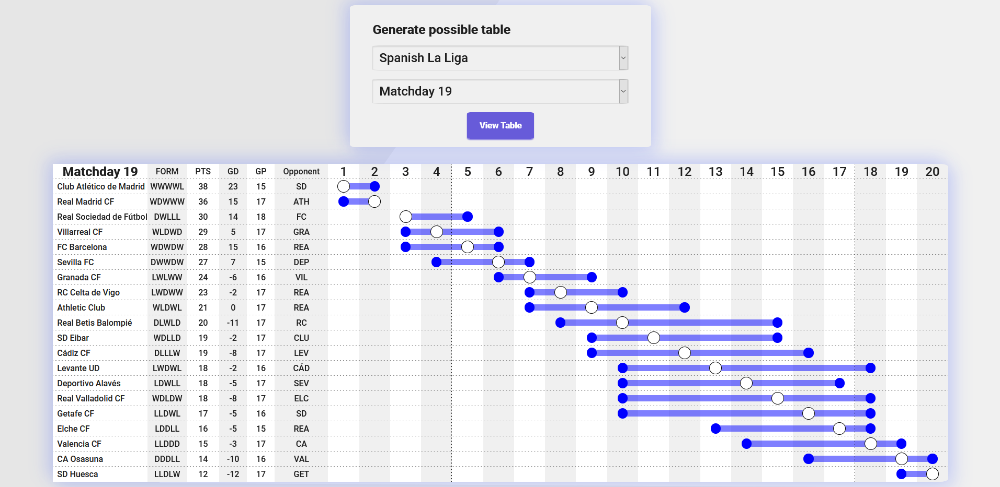

# possible-football-table-generator
Web app that displays all possible changes in the standings table after a played gameweek



## Leagues
Supported leagues: English Premier League, Spanish La Liga, Italian Serie A, French League 1, Brazilian Série A.

## Installation
```
pip install python-dotenv pandas openpyxl flask
```
- Rename .env.example to .env and set the API_KEY value equal to a generated key from https://www.football-data.org

## Usage
- ``` python app.py ```
- Navigate to the shown webserver url in a browser
